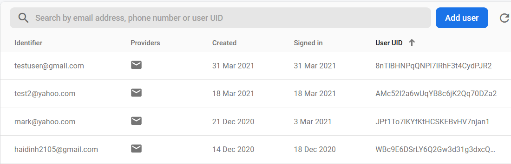
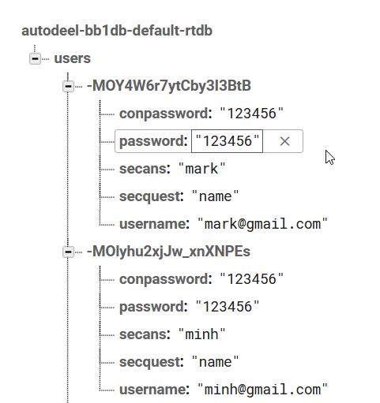

# AutoDeels - An auto trading app for the public

**My first ever android app!** Written in Java with Android Studio. 

This app was co-developed in my software project class with 2 other students. My main responsibillity was building app layout, implementing the back end functionallity and database component.

## Running the App
Download and run the **"AutoDeels.apk"** using an android emulator

Once you run the app you'll need to create an account to sign in to start exploring the app! This app was only built for a school project and isn't really built to work in reality so some functionalities might not work properly.

## Some images and GIF demonstration from the app
**Application Splash screen**
  

  
**Signup/Login Process**
 User can register for an account using the signup activity, after finish filling the form, pressing the "sign up" button will process user to the login activity, the Email and Password fields previously used in the signup activity is automatically filled in using *SharedPreferences* 
  

  
**User added to the database**
 If an account is successfully registered, it will be created and stored in our database
  

  
**Some recorded data from an account**
  

  
**Content Pages**
 Once logged in, user can explore different activities within the app, a function to logout from the account is also implemented
  

## DataBase 
The database to store user informations in this project is Google Firebase

## About the bad code
This project was built and created simultaneously as I learn to build an android application so the project was not planned or designed very well before development began and therefore there is still a lot of redundancy and the code was just horribly written. Also, this project did have a strict deadline and a lot of rules and regulations. Overall, it was a fun experience of learning android development!
